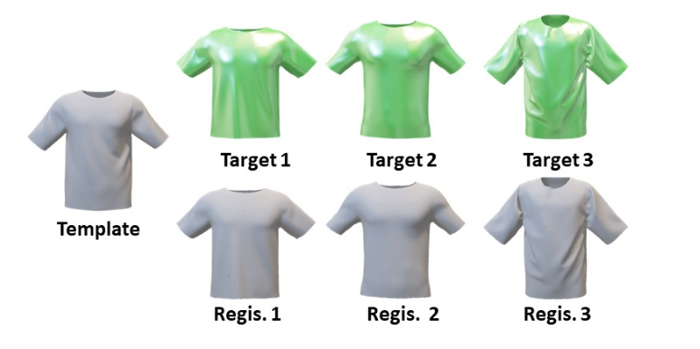
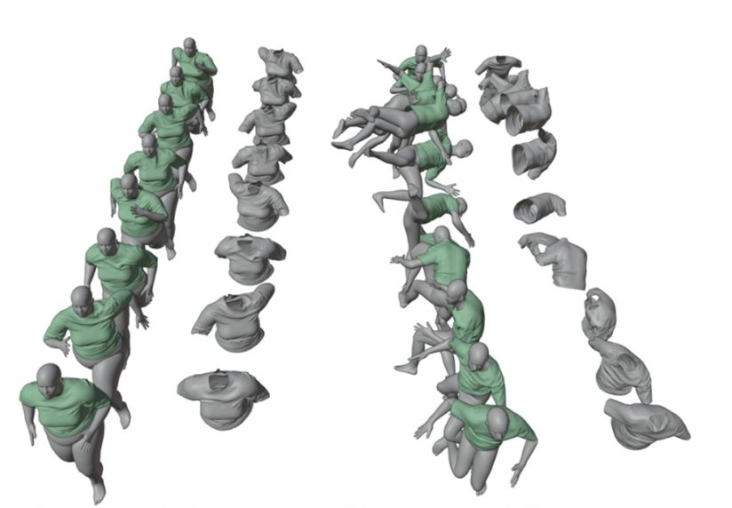

# Cloth_Registration_N_Simulation  

The public 3D cloth dataset is very rare. The available dataset has the limit of geometry missing due to 3D scanner.  
This work proposes a cloth generation pipeline to produce very precise 3D cloth.
Given a cloth template such as T-shirt, the new T-shirt can be registered by the template.
Thus, the cloth registrations have the identical topology which is crucial for training data in machine learning.

  
(Fig 1.) The leftmost cloth is the template, and the green cloth is the target cloth which consisted of different vertices number and structure.  
The cloth below green cloth is the registration.

  
(Fig 2.) By applying a physics engine, the animation of registratoin cloth are generated. 
The green cloth and grey cloth are the target cloth and registrations respectively. The data is suitable for machine learning.
